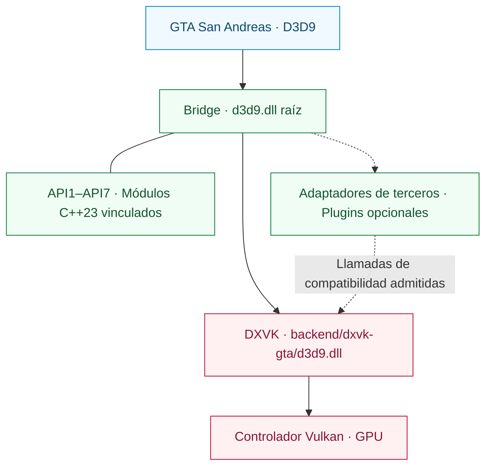

<div align="center">

# SA RenderStack

**Un runtime de renderizado modular para Grand Theft Auto: San Andreas.**

Compatibilidad con D3D9 · Ejecución en Vulkan · Diagnósticos de renderizado inspeccionables

[English](README.md) | [Português (Brasil)](README.pt-BR.md) | [Español](README.es.md) | [Русский](README.ru.md) | [简体中文](README.zh-CN.md)

[](https://github.com/prematurely/sa-renderstack/actions/workflows/windows-ci.yml)
[](https://github.com/prematurely/sa-renderstack/releases/tag/v0.1.0-alpha.1)
[](#build)
[](#architecture)
[](#compatibility)

[Descargar](https://github.com/prematurely/sa-renderstack/releases/tag/v0.1.0-alpha.1) | [Inicio Rápido](#quick-start) | [Arquitectura](#architecture) | [Módulos de la API](#api-modules) | [Compilación](#build) | [Documentación](#documentation)

</div>

---

SA RenderStack reúne en un único proyecto de código fuente un puente (Bridge) D3D9, una bifurcación (fork) de DXVK compatible con GTA y diagnósticos de renderizado. El Bridge gestiona el punto de entrada, las integraciones configuradas de terceros y los adaptadores de compatibilidad. DXVK implementa D3D9 y se encarga de la ejecución en Vulkan.

> **Línea base de la versión:** `v0.1.0-alpha.1`, GTA San Andreas **1.0 US / x86**, con **dos archivos DLL de runtime**. Este README también describe el árbol de desarrollo actual, incluidos sus subproyectos de API en C++23. Que una función exista en el código fuente no implica que el archivo comprimido publicado la contenga.

<a id="capabilities"></a>
## Capacidades

| Capa | Qué Proporciona |
| :--- | :--- |
| **Bridge** | Un único punto de entrada D3D9 raíz, registro ordenado de módulos, metadatos de propiedad de hooks y callbacks opcionales del ciclo de vida de plugins. |
| **Backend DXVK** | Traducción de D3D9 a Vulkan con exportaciones de fábrica DXGI fusionadas en el DLL del backend. |
| **Integración de Terceros** | Adaptadores de compatibilidad, registro diario (journaling) selectivo del estado nativo y procesamiento por lotes DirectConstants cuando proceda. |
| **API1–API7** | Siete subproyectos en C++23 vinculados al Bridge, con código fuente de bibliotecas, ejemplos de desarrollo y pruebas. |
| **Diagnósticos** | Atribución de estado, muestreo de puntos críticos (hotspots) de CPU, trazas de dibujado (draw traces) y estadísticas de ejecución del backend. |
| **Herramientas de Release** | Procedencia del código, comprobaciones de ABI/exportaciones, metadatos de compilación, manifiestos de paquetes y validación de archivos de reversión (rollback). |

El filtrado de bloques de estado (state-blocks), las vinculaciones diferidas (deferred bindings), los cachés de recursos y la programación opcional de hilos son experimentos configurables. Su presencia no garantiza una mejora de rendimiento en todas las cargas de trabajo.

<a id="quick-start"></a>
## Inicio Rápido

1. Descargue **`SA-RenderStack-v0.1.0-alpha.1-split.zip`** desde la [página de releases](https://github.com/prematurely/sa-renderstack/releases/tag/v0.1.0-alpha.1).
2. Cierre el juego y los procesos lanzadores. Haga una copia de seguridad de cada archivo que el paquete reemplazará, incluidos ambos DLLs de runtime y los archivos de configuración.
3. Extraiga el contenido en el directorio del juego que contiene `gta_sa.exe`, conservando las rutas del archivo comprimido.
4. Verifique la carga desde el menú hasta una partida guardada y, a continuación, valide escenas representativas y la configuración deseada de mods.

El paquete comprimido split es el paquete de runtime. Los archivos de SDK y símbolos son herramientas para desarrolladores; la instalación no requiere un compilador ni PowerShell.

Lea la [guía de instalación y reversión (en inglés)](docs/installation.md) antes de reemplazar una configuración existente.

<a id="runtime-layout"></a>
## Estructura del Runtime

```text
<Directorio de GTA>/
  gta_sa.exe
  d3d9.dll                       # Punto de entrada del Bridge
  SA.RenderStack.ini             # Configuración del Bridge
  dxvk.conf                      # Configuración del backend
  backend/
    dxvk-gta/d3d9.dll            # Backend DXVK D3D9 + DXGI
  scripts/
    BridgeD3D9.ini               # Ubicación de configuración heredada
```

**Mantenga ambos archivos DLL en sus rutas asignadas.** Copiar el backend sobre el `d3d9.dll` raíz elude el Bridge. Las exportaciones DXGI unificadas pertenecen al backend; este sigue siendo un runtime de dos DLLs (split-DLL).

<a id="architecture"></a>
## Arquitectura



El Bridge gestiona la integración y los diagnósticos. DXVK es el propietario del estado fidedigno de D3D9, el dispositivo Vulkan, los recursos, el flujo de comandos y el envío a la cola. Las optimizaciones de estado deben tener en cuenta la restauración del diario nativo y las modificaciones de bloques de estado en esa capa fidedigna.

Los callbacks de API2 graban directamente en el búfer de comandos existente de Present. Deben restaurar cualquier diseño de imagen (layout) que modifiquen y no pueden enviar, finalizar, reiniciar ni registrarse recursivamente por su cuenta desde su callback. Consulte el [mapa de módulos (en inglés)](docs/architecture/module-map.md) y el [contrato de la API del backend](sdk/include/sa_renderstack/backend_api.h).

<a id="api-modules"></a>
## Subproyectos API1–API7

**Un runtime principal, siete módulos de código.** Ambos proyectos Win32 del Bridge incluyen estas implementaciones desde `src/bridge/legacy/api-projects/`. Sus ejemplos y pruebas son objetivos de desarrollo, no siete programas desplegados por separado.

| API | Subproyecto Vinculado | Responsabilidad |
| :---: | :--- | :--- |
| **1** | [Status](src/bridge/legacy/api-projects/api1-status/) | Inspección de versión/capacidades y acceso a interoperabilidad con Vulkan. |
| **2** | [Vulkan Pass](src/bridge/legacy/api-projects/api2-vulkan-pass/) | Registro, ordenamiento y desregistro de pases de renderizado. |
| **3** | [State Batch](src/bridge/legacy/api-projects/api3-state-batch/) | Envío de rangos de constantes de shaders y vinculación de texturas. |
| **4** | [State Journal](src/bridge/legacy/api-projects/api4-state-journal/) | Captura y restauración del estado admitido del pipeline. |
| **5** | [Effect Batch](src/bridge/legacy/api-projects/api5-effect-batch/) | Envío del estado final del pase de efectos en lote. |
| **6** | [State + Draw](src/bridge/legacy/api-projects/api6-state-draw/) | Envío de un lote de estados seguido de una llamada DP/DIP inmediata. |
| **7** | [Selective Journal](src/bridge/legacy/api-projects/api7-selective-journal/) | Delimitación de la captura a operaciones de efectos propias. |

La disponibilidad de la interfaz, la compilación dentro del Bridge y la adopción en producción son hechos distintos. El perfil actual ejercita API3 y API7 mediante una ruta de integración de terceros configurada. API2 requiere un pase registrado; las bibliotecas y ejemplos de API5/API6 no garantizan adopción en la ruta crítica del juego. API6 es una interfaz de **dibujo único** (single-draw), no una cola para múltiples objetos o múltiples llamadas de dibujo.

Estas son versiones de la API de compatibilidad del backend. La [API de plugins del Bridge](src/bridge/legacy/BridgeD3D9Plugin.h) independiente utiliza su propio versionado v1/v2.

<a id="configuration"></a>
## Configuración

| Archivo | Ámbito de Gestión |
| :--- | :--- |
| [SA.RenderStack.ini](config/SA.RenderStack.ini) | Integración del Bridge, registro de módulos, diagnósticos y programación opcional de hilos. |
| [dxvk.conf](config/dxvk.conf) | Opciones de DXVK, funciones de compatibilidad con GTA, cadencia de fotogramas y HUD. |

El Bridge actual lee primero el archivo `SA.RenderStack.ini` raíz y recurre a `scripts/BridgeD3D9.ini` si no existe. Mantenga sincronizadas ambas copias si utiliza compilaciones anteriores. Use como base la configuración distribuida con la versión seleccionada.

El registro monitoriza los módulos de terceros configurados y ofrece entradas deshabilitadas para integraciones opcionales. El registro no instala componentes de terceros ausentes; los detalles se encuentran en la [guía de proxies y alojamiento de plugins (en inglés)](src/bridge/legacy/POSTFX_CHAIN.md).

> **Configuración de desarrollo:** Las opciones opcionales `[Affinity] PerThread` y `Mmcss` están fijadas en `0` por defecto. Habilitarlas es un experimento y no garantiza tiempo real ni núcleos exclusivos. El contenido del HUD de diagnóstico y los selectores de optimización pueden diferir del perfil alfa publicado.

<a id="build"></a>
## Compilación desde el Código Fuente

La compilación principal está orientada a **Windows / Release / x86**. El código fuente actual utiliza **C++23**; los proyectos del Bridge seleccionan el modo `stdcpplatest` de MSVC y los objetivos CMake de la API requieren `cxx_std_23`.

| Conjunto de Herramientas | Propósito |
| :--- | :--- |
| PowerShell 7 y Git | Orquestación de compilación y verificaciones de procedencia histórica. |
| Visual Studio 18 C++ Build Tools | Objetivos de prueba del Bridge y MSVC; toolset `v145`. |
| LLVM-MinGW, Python 3, Meson, Ninja, glslang | Backend DXVK x86 y compilación de sombreadores. |
| CMake 3.25+ | Compilación agregada opcional de ejemplos de API y pruebas unitarias. |

Ejecute desde la raíz del repositorio:

```powershell
pwsh -NoProfile -File tools/build.ps1 `
  -Configuration Release -Architecture x86 -Component All -Clean

pwsh -NoProfile -File tools/test.ps1 `
  -Configuration Release -Architecture x86
```

Las salidas de compilación se generan en `out/`; estos comandos no despliegan archivos en el directorio del juego. Consulte el parámetro `-Help` de cada script para ver rutas explícitas de herramientas y opciones de entorno.

<details>
<summary><strong>Compilar los ejemplos y pruebas de las APIs adjuntas</strong></summary>

Configure el agregado principal, no un directorio individual de API:

```powershell
cmake -S src/bridge/legacy/api-projects -B out/api-project-build/all `
  -G "Visual Studio 18 2026" -A Win32
cmake --build out/api-project-build/all --config Release
ctest --test-dir out/api-project-build/all -C Release --output-on-failure
```

La ruta principal de MSBuild compila los orígenes de las bibliotecas API directamente en el Bridge. Esta ruta opcional con CMake compila adicionalmente los ejemplos y sus pruebas unitarias. Ejecute los ejemplos de GPU con el backend previsto y una configuración explícita de compatibilidad de DXVK.

</details>

<a id="validation"></a>
## Validación y Empaquetado

Tras una compilación y conjunto de pruebas exitosos:

```powershell
pwsh -NoProfile -File tools/package.ps1 `
  -Version 0.1.0-alpha.1 -Configuration Release
pwsh -NoProfile -File tests/package-layout-test.ps1
pwsh -NoProfile -File tools/release-gate.ps1 `
  -Version 0.1.0-alpha.1 -Configuration Release
```

| Evidencia | Salida |
| :--- | :--- |
| Identidad de compilación y hashes de binarios | `out/build-metadata.json` |
| Resultados por prueba, fallos y pruebas omitidas | `out/test-results.json` |
| Manifiesto de paquetes Split, SDK, símbolos y fuentes | `out/packages/` |
| Dictamen de la puerta de release local (release-gate) | `out/reports/phase-1-release-gate.md` |

[Windows CI](.github/workflows/windows-ci.yml) ejecuta compilación, pruebas, empaquetado y comprobaciones de paquetes. Las ejecuciones alojadas omiten explícitamente sondeos de GPU y comprobaciones locales de evidencias de juego, anotando las razones en el informe. La insignia verde de CI no reemplaza las pruebas dentro del juego ni el release gate local.

<a id="diagnostics"></a>
## Diagnósticos

| Captura | Salida | Uso |
| :--- | :--- | :--- |
| **F7** | `scripts/BridgeD3D9.state-attribution.log` y registros de sesión DXVK | Atribución de efectos/estados y procesamiento por lotes del backend. |
| **F8** | `scripts/BridgeD3D9.cpuhotspots.log`, `Diagnostics/CPU/` | Muestras de puntos críticos de CPU e imágenes capturadas. |
| **F9** | `scripts/BridgeD3D9.callsites.log` | Muestreo opcional de sitios de llamada D3D9. |
| **F10** | `scripts/BridgeD3D9.drawtrace.log` | Trazado de estado opcional por cada llamada de dibujado. |
| **Backend** | `Diagnostics/DXVK/` | Diagnósticos de dispositivo, configuración y sesión. |

Las teclas y salidas dependen de la configuración habilitada. Las capturas detalladas y las consultas al HUD añaden sobrecarga; mida el rendimiento de renderizado normal de forma separada empleando la misma escena, binarios y configuración.

<a id="compatibility"></a>
## Compatibilidad y Alcance

La línea base admitida es **GTA San Andreas 1.0 US, 32 bits**, utilizando el punto de entrada del Bridge y un backend Vulkan derivado de DXVK v3.0.1. Se requiere un controlador Vulkan funcional para este backend.

El paquete publicado está destinado al runtime x86 de dos DLLs para GTA San Andreas 1.0 US. El registro y las APIs de compatibilidad proporcionan puntos de extensión para integraciones de terceros; el soporte para una combinación específica depende de su contrato de interfaz y de los resultados de validación. El runtime de una sola DLL continúa siendo un objetivo de desarrollo separado.

Los FPS, la carga progresiva de texturas (streaming), la apariencia visual de los shaders, la latencia de entrada y la estabilidad en sesiones prolongadas deben medirse bajo una carga de trabajo fija. Consulte los [hallazgos conocidos y verificaciones manuales (en inglés)](docs/development/known-audit-findings.md).

<a id="documentation"></a>
## Documentación

| Guía | Enfoque |
| :--- | :--- |
| [Instalación (en inglés)](docs/installation.md) | Estructura del paquete, primer inicio y reversión. |
| [Arquitectura (en inglés)](docs/architecture/module-map.md) | Responsabilidad de módulos y contratos de renderizado. |
| [Subproyectos de API (en inglés)](src/bridge/legacy/api-projects/README.md) | Los siete módulos de código pertenecientes al Bridge. |
| [Traspaso a Mantenedores (en inglés)](docs/development/phase-1-handoff.md) | Contexto de compilación y lanzamiento. |
| [Hallazgos de Auditoría (en inglés)](docs/development/known-audit-findings.md) | Límites conocidos y requisitos de validación. |
| [Notas de Lanzamiento (en inglés)](docs/releases/0.1.0-alpha.1.md) | Alcance de la versión alfa publicada. |

```text
backend/dxvk/                    Backend Vulkan y capa de compatibilidad para GTA
src/bridge/legacy/               Runtime principal del Bridge y adaptadores
  api-projects/                  Siete subproyectos de API en C++23 vinculados
sdk/include/sa_renderstack/      API pública del backend
config/                         Perfiles de runtime versionados
docs/                           Arquitectura, desarrollo y notas de lanzamiento
packaging/                      Contratos de estructura de paquetes
tests/                          Comprobaciones de código, ABI, empaquetado y regresiones
tools/                          Automatización de compilación, pruebas, empaquetado y releases
```

<a id="licenses"></a>
## Procedencia y Licencias

El backend deriva de [DXVK oficial v3.0.1](https://github.com/doitsujin/dxvk/tree/v3.0.1). Su [identidad upstream](backend/dxvk/SA_RENDERSTACK_UPSTREAM.toml) y las [revisiones de dependencias](backend/dxvk/SA_RENDERSTACK_DEPENDENCIES.toml) están registradas en el árbol de fuentes.

El código específico de SA RenderStack está bajo la [licencia zlib/libpng](LICENSE). Los componentes de terceros incluidos mantienen sus propias licencias, detalladas en [Avisos a Terceros (en inglés)](THIRD_PARTY_NOTICES.md). Los manifiestos de código fuente generados registran los hashes de archivos y metadatos de las herramientas para cada candidato de versión.
