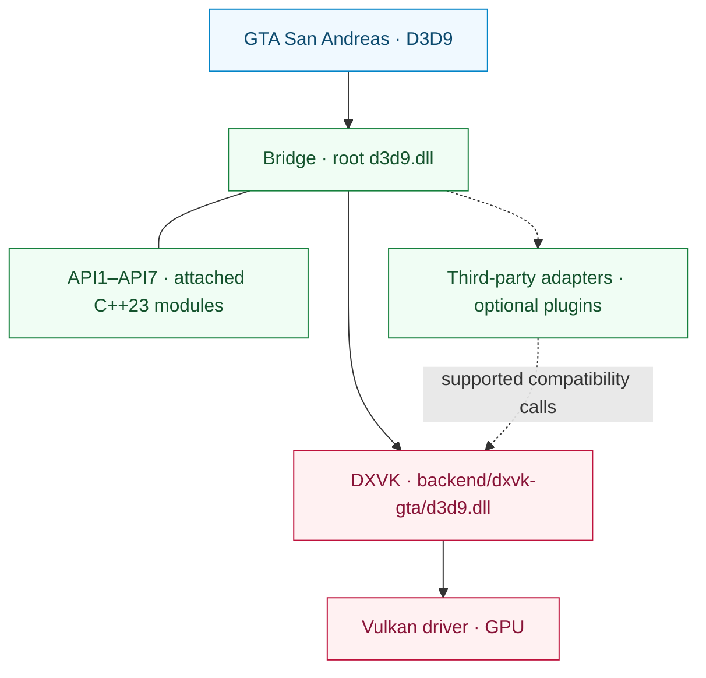

<div align="center">

# SA RenderStack

**A modular rendering runtime for Grand Theft Auto: San Andreas.**

D3D9 compatibility. Vulkan execution. Inspectable rendering.

[English](README.md) | [简体中文](README.zh-CN.md)

[](https://github.com/prematurely/sa-renderstack/actions/workflows/windows-ci.yml)
[](https://github.com/prematurely/sa-renderstack/releases/tag/v0.1.0-alpha.1)
[](#build)
[](#architecture)
[](#compatibility)

[Download](https://github.com/prematurely/sa-renderstack/releases/tag/v0.1.0-alpha.1) | [Quick Start](#quick-start) | [Architecture](#architecture) | [API Modules](#api-modules) | [Build](#build) | [Documentation](#documentation)

</div>

---

SA RenderStack brings a D3D9 Bridge, a GTA-compatible DXVK fork, and rendering diagnostics into one source project. The Bridge manages the entry point, configured third-party integration, and compatibility adapters. DXVK implements D3D9 and owns Vulkan execution.

> **Release baseline:** `v0.1.0-alpha.1`, GTA San Andreas **1.0 US / x86**, with **two runtime DLLs**. This README also describes the current development tree, including its C++23 API subprojects. A source feature is not proof that the published archive contains it.

<a id="capabilities"></a>
## Capabilities

| Layer | What It Provides |
| :--- | :--- |
| **Bridge** | One root D3D9 entry point, ordered module registration, hook-ownership metadata, and optional plugin lifecycle callbacks. |
| **DXVK Backend** | D3D9-to-Vulkan translation with DXGI factory exports merged into the backend DLL. |
| **Third-Party Integration** | Compatibility adapters, selective native state journaling, and DirectConstants state batching where eligible. |
| **API1–API7** | Seven C++23 subprojects attached to Bridge, with library sources, development examples, and tests. |
| **Diagnostics** | State attribution, CPU hotspot sampling, draw traces, and backend execution statistics. |
| **Release Tooling** | Source provenance, ABI/export checks, build metadata, package manifests, and rollback-file verification. |

State-block filtering, deferred bindings, resource caches, and optional thread scheduling are configurable experiments. Their presence does not establish a performance gain for every workload.

<a id="quick-start"></a>
## Quick Start

1. Download **`SA-RenderStack-v0.1.0-alpha.1-split.zip`** from the [release page](https://github.com/prematurely/sa-renderstack/releases/tag/v0.1.0-alpha.1).
2. Close the game and loader processes. Back up every file that the package will replace, including both runtime DLLs and configuration files.
3. Extract into the game directory containing `gta_sa.exe`, preserving the archive's paths.
4. Verify menu-to-save loading, then test your usual scenes and mod configuration.

The split archive is the runtime package. The SDK and symbols archives are development aids; installation does not require a compiler or PowerShell.

Read the [installation and rollback guide](docs/installation.md) before replacing an existing setup.

<a id="runtime-layout"></a>
## Runtime Layout

```text
<GTA directory>/
  gta_sa.exe
  d3d9.dll                       # Bridge entry point
  SA.RenderStack.ini             # Bridge configuration
  dxvk.conf                      # Backend configuration
  backend/
    dxvk-gta/d3d9.dll            # DXVK D3D9 + DXGI backend
  scripts/
    BridgeD3D9.ini               # Legacy configuration location
```

**Keep both DLLs at their assigned paths.** Copying the backend over the root `d3d9.dll` bypasses the Bridge. The merged DXGI exports belong to the backend; this is still a split-DLL runtime.

<a id="architecture"></a>
## Architecture



The Bridge manages integration and diagnostics. DXVK owns the authoritative D3D9 state, Vulkan device, resources, command stream, and queue submission. State optimizations must account for native journal restoration and state-block changes in that authoritative layer.

API2 callbacks record into the existing Present command buffer. They must restore any image layouts they change and must not independently submit, end, reset, or recursively register from their callback. See the [module map](docs/architecture/module-map.md) and [backend API contract](sdk/include/sa_renderstack/backend_api.h).

<a id="api-modules"></a>
## API1–API7 Subprojects

**One parent runtime, seven code modules.** Both Bridge Win32 projects include these implementations from `src/bridge/legacy/api-projects/`. Their examples and tests are development targets, not seven independently deployed programs.

| API | Attached Subproject | Responsibility |
| :---: | :--- | :--- |
| **1** | [Status](src/bridge/legacy/api-projects/api1-status/) | Version/capability inspection and Vulkan interop access. |
| **2** | [Vulkan Pass](src/bridge/legacy/api-projects/api2-vulkan-pass/) | Pass registration, ordering, and unregistration. |
| **3** | [State Batch](src/bridge/legacy/api-projects/api3-state-batch/) | Shader-constant ranges and texture-binding submission. |
| **4** | [State Journal](src/bridge/legacy/api-projects/api4-state-journal/) | Capture and restore supported pipeline state. |
| **5** | [Effect Batch](src/bridge/legacy/api-projects/api5-effect-batch/) | Submit final effect-pass state as a batch. |
| **6** | [State + Draw](src/bridge/legacy/api-projects/api6-state-draw/) | Submit a state batch and one immediate DP/DIP call. |
| **7** | [Selective Journal](src/bridge/legacy/api-projects/api7-selective-journal/) | Scope capture to owned effect operations. |

Interface availability, compilation into Bridge, and production adoption are separate facts. The current profile exercises API3 and API7 through a configured third-party integration path. API2 needs a registered pass; API5/API6 libraries and examples do not establish adoption in the game's hot path. API6 is a **single-draw** interface, not a multi-object or multi-draw queue.

These are backend compatibility API versions. The separate [Bridge plugin API](src/bridge/legacy/BridgeD3D9Plugin.h) uses its own v1/v2 versioning.

<a id="configuration"></a>
## Configuration

| File | Ownership |
| :--- | :--- |
| [SA.RenderStack.ini](config/SA.RenderStack.ini) | Bridge integration, module registry, diagnostics, and optional scheduling. |
| [dxvk.conf](config/dxvk.conf) | DXVK options, GTA compatibility features, frame pacing, and HUD. |

The current Bridge reads the root `SA.RenderStack.ini` first and falls back to `scripts/BridgeD3D9.ini`. Keep the two copies synchronized when using older builds. Use the configuration shipped with the selected release as its baseline.

The registry observes configured third-party modules and contains disabled ReShade/ENB entries for optional integration. Missing third-party components are not installed by the registry. Details are in [proxy and plugin hosting](src/bridge/legacy/POSTFX_CHAIN.md).

> **Development configuration:** Optional `[Affinity] PerThread` and `Mmcss` default to `0`. Enabling them is an experiment, not a real-time or exclusive-core guarantee. Diagnostic HUD contents and optimization switches can differ from the published alpha profile.

<a id="build"></a>
## Build From Source

The main build targets **Windows / Release / x86**. The current source uses **C++23**; the Bridge projects select MSVC's `stdcpplatest` mode, and the API CMake targets require `cxx_std_23`.

| Toolchain | Purpose |
| :--- | :--- |
| PowerShell 7 and Git | Build orchestration and historical provenance checks. |
| Visual Studio 18 C++ Build Tools | Bridge and MSVC test targets; toolset `v145`. |
| LLVM-MinGW, Python 3, Meson, Ninja, glslang | x86 DXVK backend and shader build. |
| CMake 3.25+ | Optional aggregate build of API examples and unit tests. |

Run from the repository root:

```powershell
pwsh -NoProfile -File tools/build.ps1 `
  -Configuration Release -Architecture x86 -Component All -Clean

pwsh -NoProfile -File tools/test.ps1 `
  -Configuration Release -Architecture x86
```

Build outputs go to `out/`; these commands do not deploy to the game directory. Use each script's `-Help` for explicit tool paths and environment-specific options.

<details>
<summary><strong>Build the attached API examples and tests</strong></summary>

Configure the parent aggregate, not an individual API directory:

```powershell
cmake -S src/bridge/legacy/api-projects -B out/api-project-build/all `
  -G "Visual Studio 18 2026" -A Win32
cmake --build out/api-project-build/all --config Release
ctest --test-dir out/api-project-build/all -C Release --output-on-failure
```

The main MSBuild path compiles the API library sources into Bridge. This optional CMake path additionally builds the examples and their unit tests. Run GPU examples against the intended backend with an explicit DXVK compatibility configuration.

</details>

<a id="validation"></a>
## Validation and Packaging

After a successful build and test run:

```powershell
pwsh -NoProfile -File tools/package.ps1 `
  -Version 0.1.0-alpha.1 -Configuration Release
pwsh -NoProfile -File tests/package-layout-test.ps1
pwsh -NoProfile -File tools/release-gate.ps1 `
  -Version 0.1.0-alpha.1 -Configuration Release
```

| Evidence | Output |
| :--- | :--- |
| Build identity and binary hashes | `out/build-metadata.json` |
| Per-test results, failures, and skips | `out/test-results.json` |
| Split, SDK, symbols, and source manifest | `out/packages/` |
| Local release-gate verdict | `out/reports/phase-1-release-gate.md` |

[Windows CI](.github/workflows/windows-ci.yml) runs build, test, packaging, and package checks. Hosted runs explicitly skip GPU probes and local-game evidence checks, recording reasons in the test report. A green CI badge does not replace game testing or the local release gate.

<a id="diagnostics"></a>
## Diagnostics

| Capture | Output | Use |
| :--- | :--- | :--- |
| **F7** | `scripts/BridgeD3D9.state-attribution.log` and DXVK session logs | Effect/state attribution and backend batching. |
| **F8** | `scripts/BridgeD3D9.cpuhotspots.log`, `Diagnostics/CPU/` | CPU hotspot samples and capture images. |
| **F9** | `scripts/BridgeD3D9.callsites.log` | Optional D3D9 call-site sampling. |
| **F10** | `scripts/BridgeD3D9.drawtrace.log` | Optional per-draw state tracing. |
| **Backend** | `Diagnostics/DXVK/` | Device, configuration, and session diagnostics. |

Keys and outputs depend on enabled configuration. Detailed captures and HUD queries add overhead; benchmark normal rendering separately using the same scene, binaries, and configuration.

<a id="compatibility"></a>
## Compatibility and Scope

The baseline is **GTA San Andreas 1.0 US, 32-bit**, using the Bridge entry point and a DXVK v3.0.1-derived Vulkan backend. A working Vulkan driver is required for that backend.

ReShade, ENB, FLA++, OLA, Project2DFX, Urbanize, and other third-party mods are not bundled. Arbitrary proxy chains and mod combinations need their own validation. The single-DLL runtime remains outside the supported split release.

FPS, texture streaming, shader appearance, input latency, and long-session stability must be measured with a fixed workload. See [known findings and manual checks](docs/development/known-audit-findings.md).

<a id="documentation"></a>
## Documentation

| Guide | Focus |
| :--- | :--- |
| [Installation](docs/installation.md) | Archive layout, first launch, and rollback. |
| [Architecture](docs/architecture/module-map.md) | Module ownership and rendering contracts. |
| [API Subprojects](src/bridge/legacy/api-projects/README.md) | The seven Bridge-owned code modules. |
| [Maintainer Handoff](docs/development/phase-1-handoff.md) | Build and release context. |
| [Audit Findings](docs/development/known-audit-findings.md) | Known limits and validation requirements. |
| [Release Notes](docs/releases/0.1.0-alpha.1.md) | Published alpha scope. |

```text
backend/dxvk/                    Vulkan backend and GTA compatibility layer
src/bridge/legacy/               Main Bridge runtime and adapters
  api-projects/                  Seven attached C++23 API subprojects
sdk/include/sa_renderstack/      Public backend API
config/                         Versioned runtime profiles
docs/                           Architecture, development, and release notes
packaging/                      Package layout contracts
tests/                          Source, ABI, packaging, and regression checks
tools/                          Build, test, package, and release automation
```

<a id="licenses"></a>
## Provenance and Licenses

The backend derives from [official DXVK v3.0.1](https://github.com/doitsujin/dxvk/tree/v3.0.1). Its [upstream identity](backend/dxvk/SA_RENDERSTACK_UPSTREAM.toml) and [dependency revisions](backend/dxvk/SA_RENDERSTACK_DEPENDENCIES.toml) are recorded in the source tree.

SA RenderStack-specific code uses the [zlib/libpng license](LICENSE). Vendored components retain their own licenses, listed in [Third-Party Notices](THIRD_PARTY_NOTICES.md). Generated source manifests record file hashes and toolchain metadata for each release candidate.
