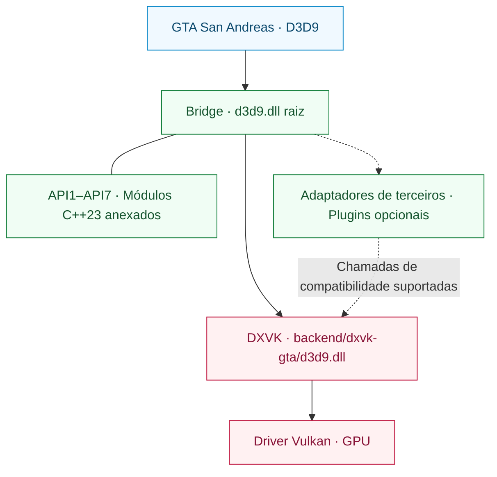

<div align="center">

# SA RenderStack

**Um runtime de renderização modular para Grand Theft Auto: San Andreas.**

Compatibilidade com D3D9 · Execução via Vulkan · Diagnósticos de renderização inspecionáveis

[English](README.md) | [Português (Brasil)](README.pt-BR.md) | [Español](README.es.md) | [Русский](README.ru.md) | [简体中文](README.zh-CN.md)

[](https://github.com/prematurely/sa-renderstack/actions/workflows/windows-ci.yml)
[](https://github.com/prematurely/sa-renderstack/releases/tag/v0.1.0-alpha.1)
[](#build)
[](#architecture)
[](#compatibility)

[Download](https://github.com/prematurely/sa-renderstack/releases/tag/v0.1.0-alpha.1) | [Início Rápido](#quick-start) | [Arquitetura](#architecture) | [Módulos da API](#api-modules) | [Compilação](#build) | [Documentação](#documentation)

</div>

---

O SA RenderStack reúne uma Bridge D3D9, um fork do DXVK compatível com GTA e diagnósticos de renderização em um único projeto de código-fonte. A Bridge gerencia o ponto de entrada, as integrações de terceiros configuradas e os adaptadores de compatibilidade. O DXVK implementa o D3D9 e é responsável pela execução em Vulkan.

> **Linha de base do release:** `v0.1.0-alpha.1`, GTA San Andreas **1.0 US / x86**, com **duas DLLs de runtime**. Este README também descreve a árvore de desenvolvimento atual, incluindo seus subprojetos de API em C++23. A presença de um recurso no código-fonte não garante que o arquivo publicado o contenha.

<a id="capabilities"></a>
## Recursos

| Camada | O que fornece |
| :--- | :--- |
| **Bridge** | Um ponto de entrada D3D9 raiz, registro ordenado de módulos, metadados de propriedade de hooks e callbacks opcionais de ciclo de vida de plugins. |
| **Backend DXVK** | Tradução de D3D9 para Vulkan com exportações da fábrica DXGI integradas à DLL do backend. |
| **Integração de Terceiros** | Adaptadores de compatibilidade, journaling seletivo de estado nativo e processamento em lote de estados DirectConstants quando aplicável. |
| **API1–API7** | Sete subprojetos em C++23 anexados à Bridge, com bibliotecas-fonte, exemplos de desenvolvimento e testes. |
| **Diagnósticos** | Atribuição de estado, amostragem de hotspots de CPU, rastreamento de draw calls e estatísticas de execução do backend. |
| **Ferramental de Release** | Proveniência de fontes, verificações de ABI/exportação, metadados de compilação, manifestos de pacotes e validação de arquivos de restauração (rollback). |

Filtragem de state blocks, vinculações postergadas (deferred bindings), caches de recursos e agendamento opcional de threads são experimentos configuráveis. Sua presença não estabelece ganho de desempenho para todas as cargas de trabalho.

<a id="quick-start"></a>
## Início Rápido

1. Baixe o arquivo **`SA-RenderStack-v0.1.0-alpha.1-split.zip`** na [página de releases](https://github.com/prematurely/sa-renderstack/releases/tag/v0.1.0-alpha.1).
2. Feche o jogo e quaisquer processos de inicializadores (loaders). Faça backup de todos os arquivos que o pacote substituirá, incluindo ambas as DLLs de runtime e arquivos de configuração.
3. Extraia o conteúdo para o diretório raiz do jogo que contém `gta_sa.exe`, preservando os caminhos do arquivo compactado.
4. Verifique o carregamento do menu até um jogo salvo e, em seguida, valide cenas representativas e a configuração de modificações desejada.

O arquivo compactado split é o pacote de runtime. Os arquivos de SDK e de símbolos são utilitários de desenvolvimento; a instalação não requer compilador nem PowerShell.

Consulte o [guia de instalação e reversão (em inglês)](docs/installation.md) antes de substituir uma instalação existente.

<a id="runtime-layout"></a>
## Estrutura do Runtime

```text
<Diretório do GTA>/
  gta_sa.exe
  d3d9.dll                       # Ponto de entrada da Bridge
  SA.RenderStack.ini             # Configuração da Bridge
  dxvk.conf                      # Configuração do backend
  backend/
    dxvk-gta/d3d9.dll            # Backend DXVK D3D9 + DXGI
  scripts/
    BridgeD3D9.ini               # Local de configuração legado
```

**Mantenha ambas as DLLs em seus caminhos atribuídos.** Copiar o backend sobre a DLL `d3d9.dll` raiz ignora a Bridge. As exportações unificadas de DXGI pertencem ao backend; este continua sendo um runtime com duas DLLs (split-DLL).

<a id="architecture"></a>
## Arquitetura



A Bridge gerencia a integração e os diagnósticos. O DXVK é proprietário do estado autoritativo do D3D9, do dispositivo Vulkan, dos recursos, do fluxo de comandos e da submissão à fila. As otimizações de estado devem levar em conta a restauração do diário nativo e as alterações de state block nessa camada autoritativa.

Os callbacks da API2 gravam diretamente no command buffer existente do Present. Eles devem restaurar quaisquer layouts de imagem que alterarem e não podem de forma independente submeter, finalizar, resetar ou registrar recursivamente a partir de seu callback. Consulte o [mapa de módulos (em inglês)](docs/architecture/module-map.md) e o [contrato da API do backend](sdk/include/sa_renderstack/backend_api.h).

<a id="api-modules"></a>
## Subprojetos API1–API7

**Um runtime principal, sete módulos de código.** Ambos os projetos Win32 da Bridge incorporam essas implementações a partir de `src/bridge/legacy/api-projects/`. Seus exemplos e testes são alvos de desenvolvimento, e não sete programas implantados separadamente.

| API | Subprojeto Anexado | Responsabilidade |
| :---: | :--- | :--- |
| **1** | [Status](src/bridge/legacy/api-projects/api1-status/) | Inspeção de versão/capacidades e acesso à interoperabilidade com Vulkan. |
| **2** | [Vulkan Pass](src/bridge/legacy/api-projects/api2-vulkan-pass/) | Registro, ordenação e cancelamento de registro de passes. |
| **3** | [State Batch](src/bridge/legacy/api-projects/api3-state-batch/) | Envio de intervalos de constantes de sombreador e vinculação de texturas. |
| **4** | [State Journal](src/bridge/legacy/api-projects/api4-state-journal/) | Captura e restauração de estados suportados do pipeline. |
| **5** | [Effect Batch](src/bridge/legacy/api-projects/api5-effect-batch/) | Envio do estado final do passe de efeito em lote. |
| **6** | [State + Draw](src/bridge/legacy/api-projects/api6-state-draw/) | Envio de um lote de estados acompanhado de uma chamada DP/DIP imediata. |
| **7** | [Selective Journal](src/bridge/legacy/api-projects/api7-selective-journal/) | Delimitação da captura apenas para operações de efeito próprias. |

A disponibilidade da interface, a compilação na Bridge e a adoção em produção são fatos distintos. O perfil atual executa a API3 e a API7 por meio de um caminho de integração de terceiros configurado. A API2 necessita de um passe registrado; as bibliotecas e exemplos de API5/API6 não implicam adoção no caminho crítico do jogo. A API6 é uma interface de **desenho único** (single-draw), e não uma fila de múltiplos objetos ou múltiplos desenhos.

Estas são versões de API de compatibilidade de backend. A [API de plugin da Bridge](src/bridge/legacy/BridgeD3D9Plugin.h) separada utiliza seu próprio versionamento v1/v2.

<a id="configuration"></a>
## Configuração

| Arquivo | Escopo de Gerenciamento |
| :--- | :--- |
| [SA.RenderStack.ini](config/SA.RenderStack.ini) | Integração da Bridge, registro de módulos, diagnósticos e agendamento opcional. |
| [dxvk.conf](config/dxvk.conf) | Opções do DXVK, recursos de compatibilidade com GTA, cadência de quadros e HUD. |

A Bridge atual lê primeiro o `SA.RenderStack.ini` raiz e recorre a `scripts/BridgeD3D9.ini` como fallback. Mantenha ambas as cópias sincronizadas ao usar compilações mais antigas. Utilize a configuração distribuída com a versão selecionada como linha de base.

O registro observa os módulos de terceiros configurados e fornece entradas desativadas para integrações opcionais. Componentes de terceiros ausentes não são instalados pelo registro. Detalhes estão disponíveis em [hospedagem de proxies e plugins (em inglês)](src/bridge/legacy/POSTFX_CHAIN.md).

> **Configuração de desenvolvimento:** As opções `[Affinity] PerThread` e `Mmcss` têm como padrão `0`. Ativá-las é um experimento e não garante tempo real ou núcleos exclusivos. Os conteúdos do HUD de diagnóstico e os seletores de otimização podem diferir do perfil alfa publicado.

<a id="build"></a>
## Compilação a partir do Código-Fonte

A compilação principal tem como alvo **Windows / Release / x86**. O código-fonte atual utiliza **C++23**; os projetos da Bridge selecionam o modo `stdcpplatest` do MSVC, e os alvos CMake das APIs exigem `cxx_std_23`.

| Conjunto de Ferramentas | Finalidade |
| :--- | :--- |
| PowerShell 7 e Git | Orquestração de compilação e verificações históricas de proveniência. |
| Visual Studio 18 C++ Build Tools | Alvos de teste da Bridge e do MSVC; toolset `v145`. |
| LLVM-MinGW, Python 3, Meson, Ninja, glslang | Backend DXVK x86 e compilação de sombreadores. |
| CMake 3.25+ | Compilação agregada opcional de exemplos de API e testes unitários. |

Execute a partir da raiz do repositório:

```powershell
pwsh -NoProfile -File tools/build.ps1 `
  -Configuration Release -Architecture x86 -Component All -Clean

pwsh -NoProfile -File tools/test.ps1 `
  -Configuration Release -Architecture x86
```

Os artefatos gerados vão para `out/`; esses comandos não realizam a instalação no diretório do jogo. Use o parâmetro `-Help` em cada script para consultar caminhos explícitos de ferramentas e opções específicas de ambiente.

<details>
<summary><strong>Compilar os exemplos e testes das APIs anexadas</strong></summary>

Configure o agregado pai, e não um diretório individual de API:

```powershell
cmake -S src/bridge/legacy/api-projects -B out/api-project-build/all `
  -G "Visual Studio 18 2026" -A Win32
cmake --build out/api-project-build/all --config Release
ctest --test-dir out/api-project-build/all -C Release --output-on-failure
```

O fluxo principal via MSBuild compila as fontes das bibliotecas de API diretamente na Bridge. Este caminho opcional do CMake compila adicionalmente os exemplos e seus testes unitários. Execute os exemplos com GPU utilizando o backend planejado e uma configuração explícita de compatibilidade do DXVK.

</details>

<a id="validation"></a>
## Validação e Empacotamento

Após uma execução bem-sucedida de compilação e testes:

```powershell
pwsh -NoProfile -File tools/package.ps1 `
  -Version 0.1.0-alpha.1 -Configuration Release
pwsh -NoProfile -File tests/package-layout-test.ps1
pwsh -NoProfile -File tools/release-gate.ps1 `
  -Version 0.1.0-alpha.1 -Configuration Release
```

| Evidência | Saída |
| :--- | :--- |
| Identidade da compilação e hashes binários | `out/build-metadata.json` |
| Resultados individuais de testes, falhas e itens ignorados | `out/test-results.json` |
| Manifesto dos pacotes Split, SDK, símbolos e fontes | `out/packages/` |
| Parecer da validação local de release (gate) | `out/reports/phase-1-release-gate.md` |

O [Windows CI](.github/workflows/windows-ci.yml) executa a compilação, os testes, o empacotamento e a validação dos pacotes. Execuções em ambiente hospedado ignoram explicitamente sondagens de GPU e evidências de instalações locais do jogo, registrando os motivos no relatório de testes. Um selo verde no CI não substitui os testes no jogo nem a validação do release gate local.

<a id="diagnostics"></a>
## Diagnósticos

| Captura | Saída | Utilização |
| :--- | :--- | :--- |
| **F7** | `scripts/BridgeD3D9.state-attribution.log` e logs de sessão do DXVK | Atribuição de efeitos/estados e processamento em lote no backend. |
| **F8** | `scripts/BridgeD3D9.cpuhotspots.log`, `Diagnostics/CPU/` | Amostras de pontos críticos de CPU e capturas de tela. |
| **F9** | `scripts/BridgeD3D9.callsites.log` | Amostragem opcional de locais de chamada (call-sites) D3D9. |
| **F10** | `scripts/BridgeD3D9.drawtrace.log` | Rastreamento opcional de estado por draw call. |
| **Backend** | `Diagnostics/DXVK/` | Diagnósticos de dispositivo, configuração e sessão. |

As teclas e saídas dependem da configuração ativada. Capturas detalhadas e consultas ao HUD aumentam o overhead; meça o desempenho de renderização normal separadamente, mantendo o mesmo cenário, binários e configuração.

<a id="compatibility"></a>
## Compatibilidade e Escopo

A linha de base suportada é **GTA San Andreas 1.0 US, 32-bit**, utilizando o ponto de entrada da Bridge e um backend Vulkan derivado do DXVK v3.0.1. Um driver com suporte adequado a Vulkan é obrigatório para esse backend.

O pacote publicado tem como alvo o runtime de duas DLLs (split-DLL) em x86 para GTA San Andreas 1.0 US. O registro e as APIs de compatibilidade oferecem pontos de extensão para integrações de terceiros; o suporte a uma combinação específica depende do seu contrato de interface e dos resultados de validação. O runtime em DLL única permanece como um alvo de desenvolvimento separado.

Taxa de quadros (FPS), streaming de texturas, aparência de shaders, latência de entrada e estabilidade em sessões longas devem ser aferidos com uma carga de trabalho consistente. Consulte as [descobertas conhecidas e verificações manuais (em inglês)](docs/development/known-audit-findings.md).

<a id="documentation"></a>
## Documentação

| Guia | Foco |
| :--- | :--- |
| [Instalação (em inglês)](docs/installation.md) | Estrutura dos arquivos, primeira inicialização e reversão. |
| [Arquitetura (em inglês)](docs/architecture/module-map.md) | Responsabilidade dos módulos e contratos de renderização. |
| [Subprojetos de API (em inglês)](src/bridge/legacy/api-projects/README.md) | Os sete módulos de código pertencentes à Bridge. |
| [Transição de Mantenedores (em inglês)](docs/development/phase-1-handoff.md) | Contexto de compilação e lançamento. |
| [Resultados de Auditoria (em inglês)](docs/development/known-audit-findings.md) | Limites conhecidos e requisitos de validação. |
| [Notas de Lançamento (em inglês)](docs/releases/0.1.0-alpha.1.md) | Escopo publicado da versão alpha. |

```text
backend/dxvk/                    Backend Vulkan e camada de compatibilidade com GTA
src/bridge/legacy/               Runtime principal da Bridge e adaptadores
  api-projects/                  Sete subprojetos de API em C++23 anexados
sdk/include/sa_renderstack/      API pública do backend
config/                         Perfis de runtime versionados
docs/                           Arquitetura, desenvolvimento e notas de release
packaging/                      Contratos de layout dos pacotes
tests/                          Verificações de fontes, ABI, empacotamento e regressão
tools/                          Automação de compilação, testes, empacotamento e release
```

<a id="licenses"></a>
## Proveniência e Licenças

O backend deriva do [DXVK oficial v3.0.1](https://github.com/doitsujin/dxvk/tree/v3.0.1). Sua [identidade upstream](backend/dxvk/SA_RENDERSTACK_UPSTREAM.toml) e [revisões de dependências](backend/dxvk/SA_RENDERSTACK_DEPENDENCIES.toml) estão registradas na árvore de fontes.

O código específico do SA RenderStack utiliza a [licença zlib/libpng](LICENSE). Componentes incorporados de terceiros mantêm suas respectivas licenças, listadas em [Avisos de Terceiros (em inglês)](THIRD_PARTY_NOTICES.md). Os manifestos de código-fonte gerados registram os hashes dos arquivos e metadados das ferramentas para cada versão candidata a release.
