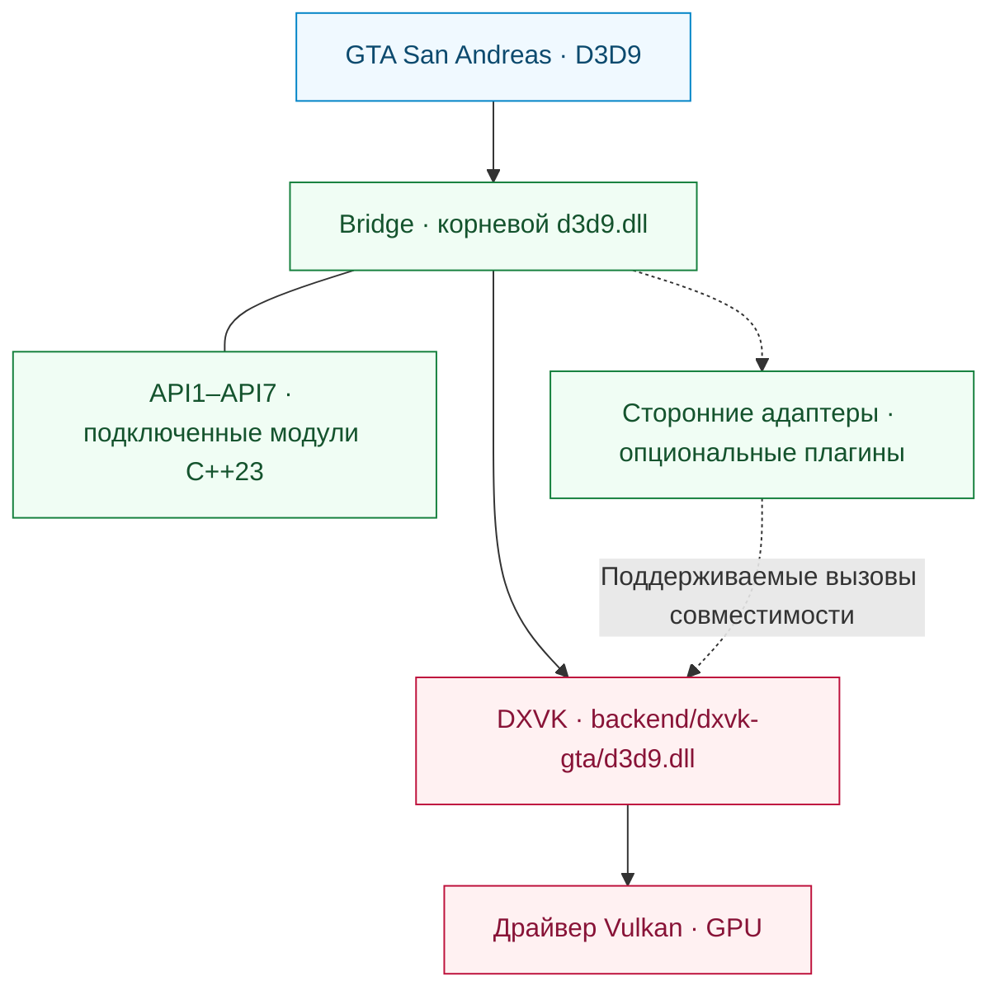

<div align="center">

# SA RenderStack

**Модульный рантайм рендеринга для Grand Theft Auto: San Andreas.**

Совместимость с D3D9 · Выполнение через Vulkan · Прозрачная диагностика рендеринга

[English](README.md) | [Português (Brasil)](README.pt-BR.md) | [Español](README.es.md) | [Русский](README.ru.md) | [简体中文](README.zh-CN.md)

[](https://github.com/prematurely/sa-renderstack/actions/workflows/windows-ci.yml)
[](https://github.com/prematurely/sa-renderstack/releases/tag/v0.1.0-alpha.1)
[](#build)
[](#architecture)
[](#compatibility)

[Скачать](https://github.com/prematurely/sa-renderstack/releases/tag/v0.1.0-alpha.1) | [Быстрый старт](#quick-start) | [Архитектура](#architecture) | [Модули API](#api-modules) | [Сборка](#build) | [Документация](#documentation)

</div>

---

SA RenderStack объединяет прослойку Bridge D3D9, совместимый с GTA форк DXVK и средства диагностики рендеринга в едином проекте с открытым исходным кодом. Bridge управляет входной точкой, настроенными сторонними интеграциями и адаптерами совместимости. DXVK реализует D3D9 и отвечает за выполнение через Vulkan.

> **Базовая версия релиза:** `v0.1.0-alpha.1`, GTA San Andreas **1.0 US / x86**, конфигурация с **двумя DLL рантайма**. Этот файл README также описывает актуальное дерево разработки, включая подпроекты API на C++23. Наличие возможности в исходном коде не означает, что она обязательно присутствует в опубликованном архиве.

<a id="capabilities"></a>
## Возможности

| Уровень | Что предоставляет |
| :--- | :--- |
| **Bridge** | Единая корневая входная точка D3D9, упорядоченная регистрация модулей, метаданные принадлежности хуков и опциональные колбэки жизненного цикла плагинов. |
| **Бэкенд DXVK** | Трансляция D3D9 в Vulkan с экспортами фабрики DXGI, объединенными в библиотеку бэкенда. |
| **Сторонние интеграции** | Адаптеры совместимости, выборочное журналирование нативного состояния и пакетная передача состояний DirectConstants при выполнении условий. |
| **API1–API7** | Семь подпроектов на C++23, подключенных к Bridge, с библиотеками исходного кода, примерами разработки и тестами. |
| **Диагностика** | Атрибуция состояний, профилирование «горячих точек» (hotspots) CPU, трассировка вызовов отрисовки (draw traces) и статистика выполнения бэкенда. |
| **Инструменты релиза** | Отслеживание происхождения исходного кода, проверки ABI/экспортов, метаданные сборки, манифесты пакетов и валидация файлов отката. |

Фильтрация блоков состояний (state-block filtering), отложенные привязки (deferred bindings), кэши ресурсов и опциональное планирование потоков являются конфигурируемыми экспериментами. Их наличие не гарантирует прирост производительности во всех сценариях нагрузки.

<a id="quick-start"></a>
## Быстрый старт

1. Скачайте архив **`SA-RenderStack-v0.1.0-alpha.1-split.zip`** со [страницы релизов](https://github.com/prematurely/sa-renderstack/releases/tag/v0.1.0-alpha.1).
2. Закройте игру и все процессы лаунчеров. Создайте резервную копию всех файлов, которые будут перезаписаны, включая обе DLL рантайма и файлы конфигурации.
3. Распакуйте архив в корневой каталог игры, содержащий `gta_sa.exe`, сохраняя структуру каталогов архива.
4. Убедитесь в успешной загрузке от главного меню до файла сохранения, затем проверьте репрезентативные игровые сцены и планируемую конфигурацию модов.

Архив `split` представляет собой исполняемый пакет рантайма. Архивы SDK и отладочных символов служат вспомогательными средствами разработки; для установки не требуются компилятор или PowerShell.

Перед заменой существующей конфигурации ознакомьтесь с [руководством по установке и откату (на английском)](docs/installation.md).

<a id="runtime-layout"></a>
## Структура рантайма

```text
<Каталог игры GTA>/
  gta_sa.exe
  d3d9.dll                       # Точка входа Bridge
  SA.RenderStack.ini             # Конфигурация Bridge
  dxvk.conf                      # Конфигурация бэкенда
  backend/
    dxvk-gta/d3d9.dll            # Бэкенд DXVK D3D9 + DXGI
  scripts/
    BridgeD3D9.ini               # Расположение устаревшей конфигурации
```

**Обязательно сохраняйте обе DLL по назначенным путям.** Копирование бэкенда поверх корневого файла `d3d9.dll` приведет к обходу Bridge. Объединенные экспорты DXGI принадлежат бэкенду; рантайм остается двухмодульным (split-DLL).

<a id="architecture"></a>
## Архитектура



Bridge отвечает за интеграцию и диагностику. DXVK владеет авторитетным состоянием D3D9, устройством Vulkan, ресурсами, потоком команд и отправкой в очередь. Оптимизации состояния обязаны учитывать восстановление нативного журнала и изменения блоков состояний в этом авторитетном слое.

Колбэки API2 записывают команды в уже существующий командный буфер Present. Они обязаны восстанавливать любые измененные ими компоновки изображений (image layouts) и не должны самостоятельно отправлять, завершать, сбрасывать буфер или рекурсивно регистрироваться изнутри своего колбэка. См. [карту модулей (на английском)](docs/architecture/module-map.md) и [контракт API бэкенда](sdk/include/sa_renderstack/backend_api.h).

<a id="api-modules"></a>
## Подпроекты API1–API7

**Один общий рантайм, семь программных модулей.** Оба проекта Win32 для Bridge включают эти реализации из каталога `src/bridge/legacy/api-projects/`. Примеры и тесты являются целями разработки, а не семью отдельно развертываемыми программами.

| API | Подключенный подпроект | Назначение |
| :---: | :--- | :--- |
| **1** | [Status](src/bridge/legacy/api-projects/api1-status/) | Опрос версии/возможностей и доступ к интерфейсам взаимодействия с Vulkan. |
| **2** | [Vulkan Pass](src/bridge/legacy/api-projects/api2-vulkan-pass/) | Регистрация, упорядочивание и отмена регистрации проходов рендеринга. |
| **3** | [State Batch](src/bridge/legacy/api-projects/api3-state-batch/) | Передача диапазонов констант шейдеров и привязок текстур. |
| **4** | [State Journal](src/bridge/legacy/api-projects/api4-state-journal/) | Захват и восстановление поддерживаемого состояния пайплайна. |
| **5** | [Effect Batch](src/bridge/legacy/api-projects/api5-effect-batch/) | Пакетная передача финального состояния прохода эффектов. |
| **6** | [State + Draw](src/bridge/legacy/api-projects/api6-state-draw/) | Передача пакета состояний и одного немедленного вызова DP/DIP. |
| **7** | [Selective Journal](src/bridge/legacy/api-projects/api7-selective-journal/) | Ограничение области захвата собственными операциями эффекта. |

Доступность интерфейса, компиляция в составе Bridge и применение в боевом окружении — это разные вещи. Текущий профиль задействует API3 и API7 через настроенный путь интеграции сторонних компонентов. API2 требует зарегистрированного прохода; наличие библиотек и примеров API5/API6 не означает их использование на критическом пути игры. API6 представляет собой интерфейс **одиночной отрисовки** (single-draw), а не очередь для множества объектов или вызовов.

Это версии API совместимости бэкенда. Отдельный [API плагинов Bridge](src/bridge/legacy/BridgeD3D9Plugin.h) использует собственную систему версионирования v1/v2.

<a id="configuration"></a>
## Конфигурация

| Файл | Зона ответственности |
| :--- | :--- |
| [SA.RenderStack.ini](config/SA.RenderStack.ini) | Интеграция Bridge, реестр модулей, диагностика и опциональное планирование. |
| [dxvk.conf](config/dxvk.conf) | Параметры DXVK, функции совместимости с GTA, темп кадров (frame pacing) и оверлей HUD. |

Актуальный Bridge сначала считывает корневой файл `SA.RenderStack.ini` и при его отсутствии возвращается к `scripts/BridgeD3D9.ini`. При использовании старых сборок поддерживайте синхронизацию обеих копий. В качестве основы используйте конфигурацию, поставляемую с выбранным релизом.

Реестр отслеживает настроенные сторонние модули и предоставляет отключенные по умолчанию записи для опциональной интеграции. Отсутствующие сторонние компоненты реестром не устанавливаются. Подробности см. в [руководстве по прокси и хостингу плагинов (на английском)](src/bridge/legacy/POSTFX_CHAIN.md).

> **Конфигурация для разработки:** Опции `[Affinity] PerThread` и `Mmcss` по умолчанию имеют значение `0`. Их включение носит экспериментальный характер и не гарантирует работу в реальном времени или эксклюзивное выделение ядер. Содержимое диагностического HUD и переключатели оптимизаций могут отличаться от опубликованного альфа-профиля.

<a id="build"></a>
## Сборка из исходного кода

Основная сборка нацелена на **Windows / Release / x86**. Текущий исходный код использует стандарт **C++23**; проекты Bridge выбирают режим `stdcpplatest` в MSVC, а цели CMake для API требуют `cxx_std_23`.

| Набор инструментов | Назначение |
| :--- | :--- |
| PowerShell 7 и Git | Оркестрация сборки и проверка исторического происхождения кода. |
| Visual Studio 18 C++ Build Tools | Сборка Bridge и тестовых целей MSVC; тулсет `v145`. |
| LLVM-MinGW, Python 3, Meson, Ninja, glslang | Сборка x86-бэкенда DXVK и компиляция шейдеров. |
| CMake 3.25+ | Опциональная агрегированная сборка примеров API и модульных тестов. |

Запуск из корня репозитория:

```powershell
pwsh -NoProfile -File tools/build.ps1 `
  -Configuration Release -Architecture x86 -Component All -Clean

pwsh -NoProfile -File tools/test.ps1 `
  -Configuration Release -Architecture x86
```

Результаты сборки помещаются в `out/`; эти команды не выполняют установку в каталог игры. Используйте параметр `-Help` для каждого скрипта, чтобы узнать пути к инструментам и специфичные для среды опции.

<details>
<summary><strong>Сборка примеров и тестов подключенных API</strong></summary>

Конфигурируйте родительский агрегатор, а не отдельный каталог API:

```powershell
cmake -S src/bridge/legacy/api-projects -B out/api-project-build/all `
  -G "Visual Studio 18 2026" -A Win32
cmake --build out/api-project-build/all --config Release
ctest --test-dir out/api-project-build/all -C Release --output-on-failure
```

Основной процесс через MSBuild компилирует исходный код библиотек API напрямую в состав Bridge. Этот опциональный путь через CMake дополнительно собирает примеры и их модульные тесты. Запускайте примеры с использованием GPU на целевом бэкенде с явной конфигурацией совместимости DXVK.

</details>

<a id="validation"></a>
## Проверка и упаковка

После успешной сборки и выполнения тестов:

```powershell
pwsh -NoProfile -File tools/package.ps1 `
  -Version 0.1.0-alpha.1 -Configuration Release
pwsh -NoProfile -File tests/package-layout-test.ps1
pwsh -NoProfile -File tools/release-gate.ps1 `
  -Version 0.1.0-alpha.1 -Configuration Release
```

| Доказательство | Выходной файл |
| :--- | :--- |
| Идентификатор сборки и хэши бинарных файлов | `out/build-metadata.json` |
| Результаты тестов, сбои и пропущенные проверки | `out/test-results.json` |
| Манифест пакетов Split, SDK, символов и исходного кода | `out/packages/` |
| Заключение локального гейта релиза (release-gate) | `out/reports/phase-1-release-gate.md` |

[Windows CI](.github/workflows/windows-ci.yml) запускает сборку, тестирование, упаковку и проверку целостности пакетов. При запуске на серверах CI намеренно пропускаются зонды GPU и проверки локальных игровых файлов, а причины фиксируются в отчете. Зеленый значок CI не заменяет реальное тестирование в игре и прохождение локального release gate.

<a id="diagnostics"></a>
## Диагностика

| Захват | Выходные данные | Применение |
| :--- | :--- | :--- |
| **F7** | `scripts/BridgeD3D9.state-attribution.log` и логи сессии DXVK | Атрибуция эффектов/состояний и пакетная обработка бэкенда. |
| **F8** | `scripts/BridgeD3D9.cpuhotspots.log`, `Diagnostics/CPU/` | Выборки «горячих точек» CPU и захваченные кадры. |
| **F9** | `scripts/BridgeD3D9.callsites.log` | Опциональное профилирование точек вызова D3D9. |
| **F10** | `scripts/BridgeD3D9.drawtrace.log` | Опциональная трассировка состояний для каждого вызова отрисовки. |
| **Бэкенд** | `Diagnostics/DXVK/` | Диагностика устройства, конфигурации и сессии. |

Горячие клавиши и вывод зависят от включенной конфигурации. Подробный захват данных и опрос HUD создают дополнительную нагрузку; производительность обычного рендеринга следует измерять отдельно при неизменных сцене, бинарных файлах и настройках.

<a id="compatibility"></a>
## Совместимость и область применения

Базовой платформой является **GTA San Andreas 1.0 US, 32-bit**, использующая входную точку Bridge и бэкенд Vulkan на базе DXVK v3.0.1. Для работы бэкенда требуется корректно установленный драйвер Vulkan.

Опубликованный пакет ориентирован на рантайм из двух DLL (split-DLL) для GTA San Andreas 1.0 US под x86. Реестр и API совместимости предоставляют точки расширения для сторонних интеграций; работоспособность конкретной связки зависит от контракта интерфейса и результатов валидации. Одномодульный рантайм (single-DLL) остается отдельной целью разработки.

Показатели FPS, стриминг текстур, визуальная точность шейдеров, задержка ввода и стабильность при длительных сессиях должны оцениваться при фиксированной нагрузке. См. [известные результаты аудита и ручные проверки (на английском)](docs/development/known-audit-findings.md).

<a id="documentation"></a>
## Документация

| Руководство | Тематика |
| :--- | :--- |
| [Установка (на английском)](docs/installation.md) | Структура архива, первый запуск и откат. |
| [Архитектура (на английском)](docs/architecture/module-map.md) | Зоны ответственности модулей и контракты рендеринга. |
| [Подпроекты API (на английском)](src/bridge/legacy/api-projects/README.md) | Семь программных модулей, принадлежащих Bridge. |
| [Передача мейнтейнеру (на английском)](docs/development/phase-1-handoff.md) | Контекст сборки и подготовки релиза. |
| [Результаты аудита (на английском)](docs/development/known-audit-findings.md) | Известные ограничения и требования к валидации. |
| [Примечания к релизу (на английском)](docs/releases/0.1.0-alpha.1.md) | Состав опубликованной альфа-версии. |

```text
backend/dxvk/                    Бэкенд Vulkan и слой совместимости с GTA
src/bridge/legacy/               Основной рантайм Bridge и адаптеры
  api-projects/                  Семь подключенных подпроектов API на C++23
sdk/include/sa_renderstack/      Публичный API бэкенда
config/                         Версионированные профили рантайма
docs/                           Архитектура, разработка и примечания к релизам
packaging/                      Контракты структуры пакетов
tests/                          Проверки исходного кода, ABI, упаковки и регрессий
tools/                          Автоматизация сборки, тестирования, упаковки и релизов
```

<a id="licenses"></a>
## Происхождение и лицензии

Бэкенд создан на основе [официального DXVK v3.0.1](https://github.com/doitsujin/dxvk/tree/v3.0.1). Информация об [апстриме](backend/dxvk/SA_RENDERSTACK_UPSTREAM.toml) и [версиях зависимостей](backend/dxvk/SA_RENDERSTACK_DEPENDENCIES.toml) зафиксирована в дереве исходного кода.

Собственный код SA RenderStack распространяется по [лицензии zlib/libpng](LICENSE). Сторонние компоненты сохраняют свои исходные лицензии, перечисленные в [Уведомлениях о стороннем ПО (на английском)](THIRD_PARTY_NOTICES.md). Формируемые манифесты исходного кода содержат хэши файлов и метаданные инструментария для каждого кандидата в релиз.
