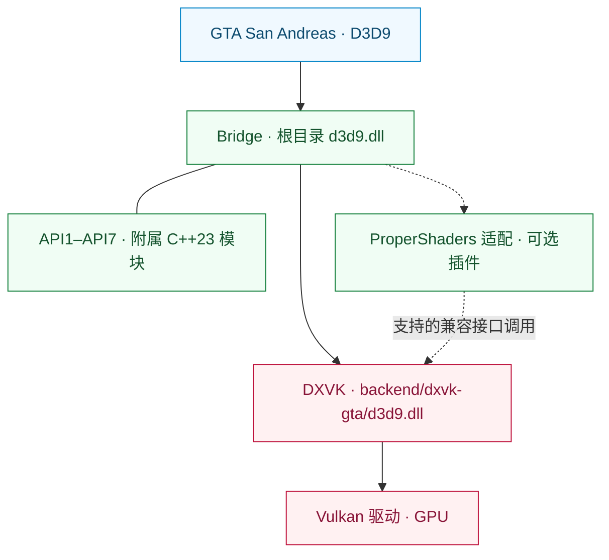

<div align="center">

# SA RenderStack

**面向《侠盗猎车手：圣安地列斯》的模块化渲染运行时。**

D3D9 兼容接入 · Vulkan 后端执行 · 可追踪的渲染诊断

[English](README.md) | [简体中文](README.zh-CN.md)

[](https://github.com/prematurely/sa-renderstack/actions/workflows/windows-ci.yml)
[](https://github.com/prematurely/sa-renderstack/releases/tag/v0.1.0-alpha.1)
[](#build)
[](#architecture)
[](#compatibility)

[下载版本](https://github.com/prematurely/sa-renderstack/releases/tag/v0.1.0-alpha.1) | [快速开始](#quick-start) | [架构](#architecture) | [API 子项目](#api-modules) | [源码构建](#build) | [文档索引](#documentation)

</div>

---

SA RenderStack 将 D3D9 桥接层、面向 GTA 的 DXVK 分支和渲染诊断纳入同一个源码工程。Bridge 管理入口、已配置的代理与插件集成，以及 ProperShaders 适配；DXVK 实现 D3D9，并负责 Vulkan 执行。

> **发布基线：** `v0.1.0-alpha.1`，面向 GTA San Andreas **1.0 US / x86**，采用**两个运行时 DLL**。本说明同时介绍当前开发源码，包括其中的 C++23 API 子项目；源码已有的功能不代表已发布压缩包一定包含。

<a id="capabilities"></a>
## 核心能力

| 层级 | 提供的能力 |
| :--- | :--- |
| **Bridge 桥接层** | 游戏根目录的统一 D3D9 入口、有序模块注册、钩子归属声明，以及可选的插件生命周期回调。 |
| **DXVK 后端** | 将 D3D9 转换为 Vulkan，并将 DXGI 工厂导出合入后端 DLL。 |
| **ProperShaders 适配** | 选择性原生状态日志，以及满足条件时使用的 DirectConstants 状态批量提交路径。 |
| **API1–API7** | 附属于 Bridge 的七个 C++23 子项目，包含库源码、开发示例和测试。 |
| **诊断体系** | 状态归因、CPU 热点采样、逐次绘制跟踪和后端执行统计。 |
| **发布工具链** | 源码来源追踪、ABI 与导出检查、构建元数据、包清单和回滚文件校验。 |

状态块过滤、延迟绑定、资源缓存和可选线程调度属于可配置的实验功能。功能存在本身不代表每种负载都能获得性能提升。

<a id="quick-start"></a>
## 快速开始

1. 从[发布页面](https://github.com/prematurely/sa-renderstack/releases/tag/v0.1.0-alpha.1)下载 **`SA-RenderStack-v0.1.0-alpha.1-split.zip`**。
2. 关闭游戏及加载器进程，备份压缩包将覆盖的全部文件，包括两个运行时 DLL 和配置文件。
3. 解压到包含 `gta_sa.exe` 的游戏目录，保留压缩包中的相对路径。
4. 先确认菜单与存档能够加载，再测试常用场景和模组配置。

`split` 压缩包是运行时安装包。SDK 和符号包用于开发与诊断；安装不需要编译器或 PowerShell。

替换现有安装前，请阅读[安装与回滚指南（英文）](docs/installation.md)。

<a id="runtime-layout"></a>
## 运行时布局

```text
<游戏目录>/
  gta_sa.exe
  d3d9.dll                       # Bridge 入口
  SA.RenderStack.ini             # Bridge 配置
  dxvk.conf                      # 后端配置
  backend/
    dxvk-gta/d3d9.dll            # DXVK D3D9 + DXGI 后端
  scripts/
    BridgeD3D9.ini               # 旧版配置位置
```

**两个 DLL 必须保留在各自路径。** 用后端文件覆盖根目录 `d3d9.dll` 会绕过 Bridge。DXGI 导出合并发生在后端内部，整个运行时仍采用双 DLL 布局。

<a id="architecture"></a>
## 架构



Bridge 管理集成与诊断。DXVK 持有权威 D3D9 状态，并管理 Vulkan 设备、资源、命令流和队列提交。状态优化必须考虑这一层中的原生日志恢复和状态块变更。

API2 回调将命令录入现有的 Present 命令缓冲区，必须恢复自己改变的图像布局，并遵守不得自行提交、结束、重置命令缓冲区或在回调内递归注册的约束。详见[模块关系（英文）](docs/architecture/module-map.md)和[后端 API 契约](sdk/include/sa_renderstack/backend_api.h)。

<a id="api-modules"></a>
## API1–API7 子项目

**一个主运行时，七个代码模块。** 两个 Bridge Win32 工程都从 `src/bridge/legacy/api-projects/` 纳入这些实现。示例和测试属于开发目标，并非七个分别部署的应用。

| API | 附属子项目 | 职责 |
| :---: | :--- | :--- |
| **1** | [状态查询](src/bridge/legacy/api-projects/api1-status/) | 查询版本、能力和 Vulkan 互操作接口。 |
| **2** | [Vulkan 通道](src/bridge/legacy/api-projects/api2-vulkan-pass/) | 注册、排序和注销渲染通道。 |
| **3** | [状态批次](src/bridge/legacy/api-projects/api3-state-batch/) | 提交着色器常量范围与纹理绑定。 |
| **4** | [状态日志](src/bridge/legacy/api-projects/api4-state-journal/) | 捕获并恢复支持的管线状态。 |
| **5** | [效果状态批次](src/bridge/legacy/api-projects/api5-effect-batch/) | 批量提交效果通道的最终状态。 |
| **6** | [状态与绘制](src/bridge/legacy/api-projects/api6-state-draw/) | 提交状态批次及紧随其后的一个 DP/DIP 调用。 |
| **7** | [选择性状态日志](src/bridge/legacy/api-projects/api7-selective-journal/) | 将捕获范围限制在所属效果操作内。 |

接口可用、编译纳入 Bridge、实际进入生产路径是不同事实。已有的 ProperShaders 路径使用 API3 和 API7；API2 需要注册实际通道，API5/API6 的库与示例也不代表游戏热点路径已经采用。API6 是**单次绘制**接口，不是多对象或多次绘制队列。

以上属于后端兼容 API 版本；另一个[Bridge 插件 API](src/bridge/legacy/BridgeD3D9Plugin.h)采用自身的 v1/v2 版本体系。

<a id="configuration"></a>
## 配置

| 文件 | 管理范围 |
| :--- | :--- |
| [SA.RenderStack.ini](config/SA.RenderStack.ini) | Bridge 集成、模块注册、诊断和可选线程调度。 |
| [dxvk.conf](config/dxvk.conf) | DXVK 选项、GTA 兼容功能、帧节奏和屏幕统计。 |

当前 Bridge 优先读取根目录 `SA.RenderStack.ini`，不存在时回退到 `scripts/BridgeD3D9.ini`。使用旧构建时应保持两份配置同步，并以所选发布版本随附的配置作为基线。

注册表用于观察 ProperShaders，并提供默认禁用的 ReShade/ENB 条目供可选集成。它不会安装缺失的第三方组件，详见[代理与插件托管说明（英文）](src/bridge/legacy/POSTFX_CHAIN.md)。

> **开发配置：** `[Affinity] PerThread` 和 `Mmcss` 默认均为 `0`。启用它们属于实验，不保证硬实时或核心独占。诊断界面内容、优化开关也可能与已发布的 alpha 配置不同。

<a id="build"></a>
## 源码构建

主构建面向 **Windows / Release / x86**。当前源码使用 **C++23**；Bridge 工程选择 MSVC 的 `stdcpplatest` 模式，API 子项目的 CMake 目标要求 `cxx_std_23`。

| 工具链 | 用途 |
| :--- | :--- |
| PowerShell 7 与 Git | 构建编排和历史来源校验。 |
| Visual Studio 18 C++ Build Tools | Bridge 与 MSVC 测试目标，使用 `v145` 工具集。 |
| LLVM-MinGW、Python 3、Meson、Ninja、glslang | x86 DXVK 后端与着色器构建。 |
| CMake 3.25+ | 可选的 API 示例与单元测试聚合构建。 |

从仓库根目录执行：

```powershell
pwsh -NoProfile -File tools/build.ps1 `
  -Configuration Release -Architecture x86 -Component All -Clean

pwsh -NoProfile -File tools/test.ps1 `
  -Configuration Release -Architecture x86
```

构建产物写入 `out/`，这些命令不会部署到游戏目录。显式工具路径和环境选项请查看各脚本的 `-Help`。

<details>
<summary><strong>构建附属 API 示例与测试</strong></summary>

使用父级聚合入口配置，不直接配置单个 API 目录：

```powershell
cmake -S src/bridge/legacy/api-projects -B out/api-project-build/all `
  -G "Visual Studio 18 2026" -A Win32
cmake --build out/api-project-build/all --config Release
ctest --test-dir out/api-project-build/all -C Release --output-on-failure
```

主 MSBuild 路径将 API 库源码纳入 Bridge 编译；这条可选 CMake 路径额外构建示例及其单元测试。运行 GPU 示例时，应指定目标后端和显式启用兼容接口的 DXVK 配置。

</details>

<a id="validation"></a>
## 验证与打包

构建和测试成功后执行：

```powershell
pwsh -NoProfile -File tools/package.ps1 `
  -Version 0.1.0-alpha.1 -Configuration Release
pwsh -NoProfile -File tests/package-layout-test.ps1
pwsh -NoProfile -File tools/release-gate.ps1 `
  -Version 0.1.0-alpha.1 -Configuration Release
```

| 验证依据 | 输出位置 |
| :--- | :--- |
| 构建身份与二进制哈希 | `out/build-metadata.json` |
| 逐项测试结果、失败与跳过原因 | `out/test-results.json` |
| 运行时包、SDK、符号包和源码清单 | `out/packages/` |
| 本地发布门禁结论 | `out/reports/phase-1-release-gate.md` |

[Windows 持续集成](.github/workflows/windows-ci.yml)执行构建、测试、打包和包结构检查。托管运行会显式跳过 GPU 探针和本地游戏证据检查，并记录原因。绿色持续集成徽章不能替代游戏实测或本地发布门禁。

<a id="diagnostics"></a>
## 诊断工具

| 采集入口 | 输出位置 | 用途 |
| :--- | :--- | :--- |
| **F7** | `scripts/BridgeD3D9.state-attribution.log` 与 DXVK 会话日志 | 效果与状态归因、后端批次统计。 |
| **F8** | `scripts/BridgeD3D9.cpuhotspots.log`、`Diagnostics/CPU/` | CPU 热点样本和采集图像。 |
| **F9** | `scripts/BridgeD3D9.callsites.log` | 可选的 D3D9 调用位置采样。 |
| **F10** | `scripts/BridgeD3D9.drawtrace.log` | 可选的逐次绘制状态跟踪。 |
| **后端日志** | `Diagnostics/DXVK/` | 设备、配置和运行会话诊断。 |

按键和输出取决于启用的配置。详细采集与屏幕统计查询会增加开销；性能对比应另行测量正常渲染，并保持场景、二进制和配置一致。

<a id="compatibility"></a>
## 兼容性与范围

支持基线为 **GTA San Andreas 1.0 US，32 位**，使用 Bridge 入口和基于 DXVK v3.0.1 的 Vulkan 后端。该后端需要可用的 Vulkan 驱动。

项目不捆绑 ReShade、ENB、FLA++、OLA、Project2DFX、Urbanize 等第三方模组。任意代理链和模组组合需要单独验证，单 DLL 运行时尚不属于当前双 DLL 发布的支持范围。

帧率、纹理流式加载、着色器外观、输入延迟和长时间稳定性，都需要针对固定负载测量。详见[已知问题与人工检查项（英文）](docs/development/known-audit-findings.md)。

<a id="documentation"></a>
## 文档索引

| 指南 | 内容 |
| :--- | :--- |
| [安装指南（英文）](docs/installation.md) | 压缩包布局、首次启动和回滚。 |
| [架构说明（英文）](docs/architecture/module-map.md) | 模块归属与渲染契约。 |
| [API 子项目](src/bridge/legacy/api-projects/README.md) | Bridge 拥有的七个代码模块。 |
| [维护者交接（英文）](docs/development/phase-1-handoff.md) | 构建与发布背景。 |
| [审计记录（英文）](docs/development/known-audit-findings.md) | 已知限制和验证要求。 |
| [版本说明（英文）](docs/releases/0.1.0-alpha.1.md) | 已发布 alpha 的范围。 |

```text
backend/dxvk/                    Vulkan 后端与 GTA 兼容层
src/bridge/legacy/               主 Bridge 运行时与适配器
  api-projects/                  七个附属 C++23 API 子项目
sdk/include/sa_renderstack/      公开后端 API
config/                         版本化运行配置
docs/                           架构、开发与版本说明
packaging/                      安装包布局契约
tests/                          源码、ABI、打包与回归检查
tools/                          构建、测试、打包与发布自动化
```

<a id="licenses"></a>
## 来源与许可证

后端基于[官方 DXVK v3.0.1](https://github.com/doitsujin/dxvk/tree/v3.0.1)。源码树记录了[上游身份](backend/dxvk/SA_RENDERSTACK_UPSTREAM.toml)和[依赖版本](backend/dxvk/SA_RENDERSTACK_DEPENDENCIES.toml)。

SA RenderStack 项目自身的代码采用 [zlib/libpng 许可证](LICENSE)。第三方组件保留各自许可证，详见[第三方声明（英文）](THIRD_PARTY_NOTICES.md)。生成的源码清单会记录每个候选发布版本的文件哈希与工具链元数据。
